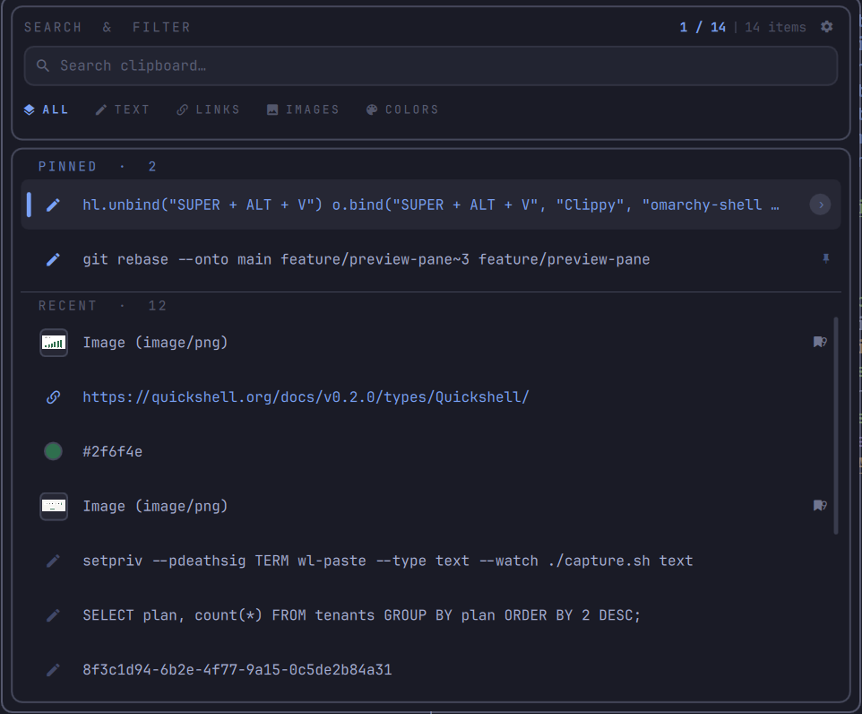
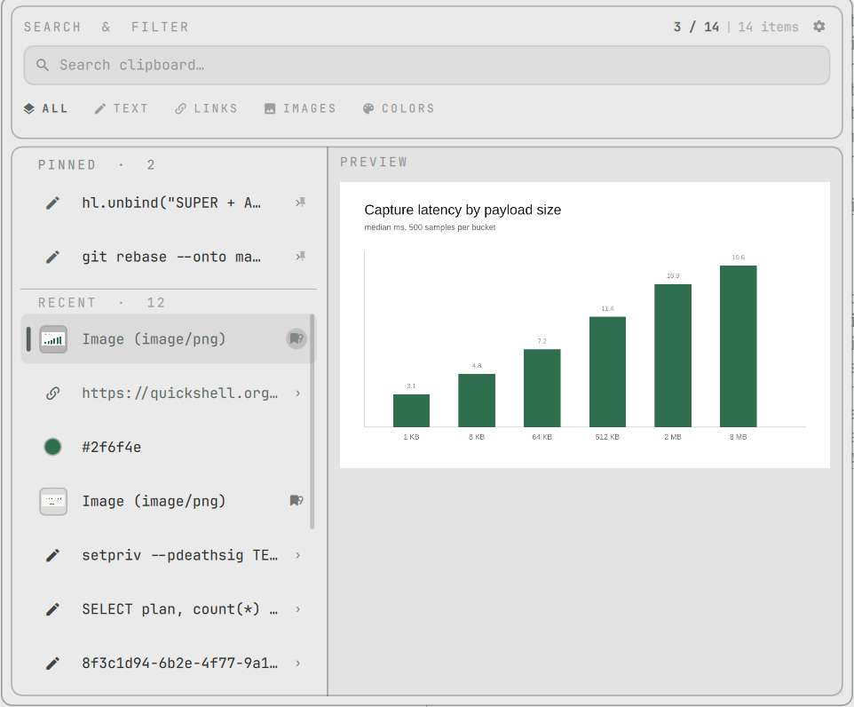

<div align="center">

# Yank

**A clipboard manager for the Omarchy shell.**
Everything you copy, one keystroke away — searchable, previewable, and pasted
back into the window you were already in.

`de.gransoftware.yank`&nbsp;&nbsp;·&nbsp;&nbsp;&nbsp;&nbsp;&nbsp;

<table>
  <tr>
    <td width="50%"></td>
    <td width="50%"></td>
  </tr>
  <tr>
    <td align="center"><sub>Searching the history</sub></td>
    <td align="center"><sub>Preview pane, light theme</sub></td>
  </tr>
</table>

<sub>Yank follows the active Omarchy theme.</sub>

</div>

---

##  Why

Omarchy already ships a clipboard manager; Yank adds what it lacks — entries you
can pin and order by hand, an actions menu, and a paste that writes straight to
a terminal's tty instead of synthesising a keystroke.

##  Features

- **Catches everything you copy**, text and images, in the background. Skips
  password managers.
- **Search and filters**: all, text, links, images, colors.
- **Preview pane** for the full text or the image.
- **Pinned entries** stay on top, in your own order, and are never removed —
  not by Delete, not by clear, not by the size or age limits — until you unpin.
- **Pastes into terminals properly**, not with a fake `Ctrl+V`.
- **Actions menu**: open a link, edit a copy, save an image, remove.
- **Keeps 200 unpinned entries**, or fewer days if you set a limit.

##  Keys

`SUPER+ALT+V` opens the panel. `?` shows the same list inside the app.

<table>
  <tr><td width="28"></td><td><code>Ctrl+J</code> <code>Ctrl+K</code> · arrows</td><td>Move through the list</td></tr>
  <tr><td width="28"></td><td><code>Tab</code> · <code>Ctrl+H</code> <code>Ctrl+L</code> · <code>Ctrl+1–5</code></td><td>Switch filter</td></tr>
  <tr><td width="28"></td><td><code>Enter</code></td><td>Paste into the focused window</td></tr>
  <tr><td width="28"></td><td><code>Shift+Enter</code></td><td>Copy only, without pasting</td></tr>
  <tr><td width="28"></td><td><code>Ctrl+O</code></td><td>Toggle the preview pane</td></tr>
  <tr><td width="28"></td><td><code>Ctrl+.</code></td><td>Actions menu</td></tr>
  <tr><td width="28"></td><td><code>Ctrl+P</code> · <code>Shift+Ctrl+J</code> <code>Shift+Ctrl+K</code></td><td>Pin / unpin · reorder the shelf</td></tr>
  <tr><td width="28"></td><td><code>Delete</code> <code>Ctrl+D</code></td><td>Remove the selected entry (pinned entries must be unpinned first)</td></tr>
  <tr><td width="28"></td><td><code>Shift+Delete</code></td><td>Clear every unpinned entry</td></tr>
  <tr><td width="28"></td><td><code>Ctrl+,</code></td><td>Settings</td></tr>
  <tr><td width="28"></td><td><code>?</code></td><td>Keyboard reference</td></tr>
  <tr><td width="28"></td><td><code>Esc</code></td><td>Clear search, then close</td></tr>
</table>

##  Install

```bash
omarchy plugin add https://github.com/gran-software-solutions/yank-omarchy-plugin.git --enable --yes
```

Then bind the panel in `~/.config/hypr/bindings.lua`:

```lua
hl.unbind("SUPER + ALT + V")
o.bind("SUPER + ALT + V", "Yank", "omarchy-shell shell toggle de.gransoftware.yank")
```

Open it once — an overlay mounts on its first summon, and that is when
background capture starts.

The plugin never touches your configuration itself; the binding above is the
only change, and it is yours to make.

### Dependencies

Nothing to install first. The plugin shells out to `wl-paste` and `wl-copy`
(`wl-clipboard`), `jq`, `wtype`, `setpriv` (`util-linux`) and `hyprctl`
(`hyprland`), all of which ship with Omarchy.

### Update and remove

```bash
omarchy plugin update de.gransoftware.yank
omarchy plugin remove de.gransoftware.yank
```

After removing, delete the two binding lines from `bindings.lua`. Your history
stays in `~/.local/state/omarchy/yank/` until you delete that folder too.

##  Privacy

History is stored unencrypted on disk, in your state directory, and never leaves
the machine — the plugin makes no network requests. Selections that a password
manager marks as sensitive are not recorded. `Shift+Delete` clears everything
that is not pinned.

<details>
<summary> <b>How it works</b></summary>

<br>

```
  copy something
        │
        ▼
  wl-paste --watch ──▶ capture.sh ──▶ one JSON line ──▶ Yank.qml
                       (sanitise,                        (dedupe, cap,
                        hash images)                      expire)
                                                              │
                                     history.json + images/ ◀─┤
                                                              │
  Enter ──▶ paste.sh ──▶ wl-copy ──▶ terminal tty, or synthetic Ctrl+V
```

| File | Purpose |
|------|---------|
| `Yank.qml` | Overlay UI and the clipboard watchers |
| `YankHistory.js` | History model helpers — dedupe, filter, row shaping |
| `capture.sh` | Serialises the current selection to a JSON line |
| `paste.sh` | Delivers an entry to the focused window |
| `manifest.json` | Plugin manifest — `overlay` kind, `keepLoaded` |

State lives in `~/.local/state/omarchy/yank/` (or under
`$XDG_STATE_HOME`) as `history.json`,
`settings.json` and `images/`. It is not keyed by plugin id, so renaming or
reinstalling the plugin keeps your history.

</details>

<details>
<summary> <b>Development</b></summary>

<br>

The install is a plain git checkout, so edit it in place — the shell
hot-reloads on save, or force it with `omarchy-shell shell rescanPlugins`.

To work from a checkout somewhere else instead, symlink it into the plugins
folder:

```bash
ln -s "$PWD" ~/.config/omarchy/plugins/de.gransoftware.yank
omarchy-shell shell rescanPlugins
```

</details>

##  Vibe-coded

Every line of this plugin — the QML, the shell scripts, this README — was
written by [Claude](https://claude.com/claude-code) from conversational
prompts, not typed out by hand. The usual caveat for a third-party plugin
applies twice over: it runs unsandboxed inside `omarchy-shell`, so read the
source before you enable it.

##  License

[MIT](LICENSE) © Gran Software Solutions

Key icons from [Phosphor Icons](https://phosphoricons.com), MIT — see
[`icons/LICENSE`](icons/LICENSE).
